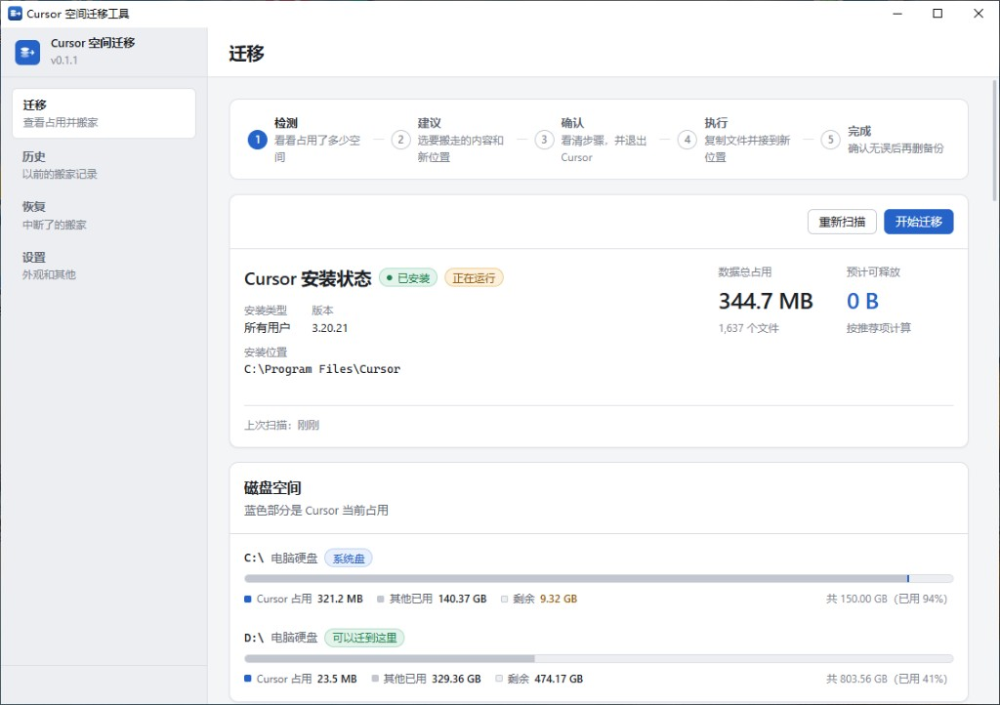
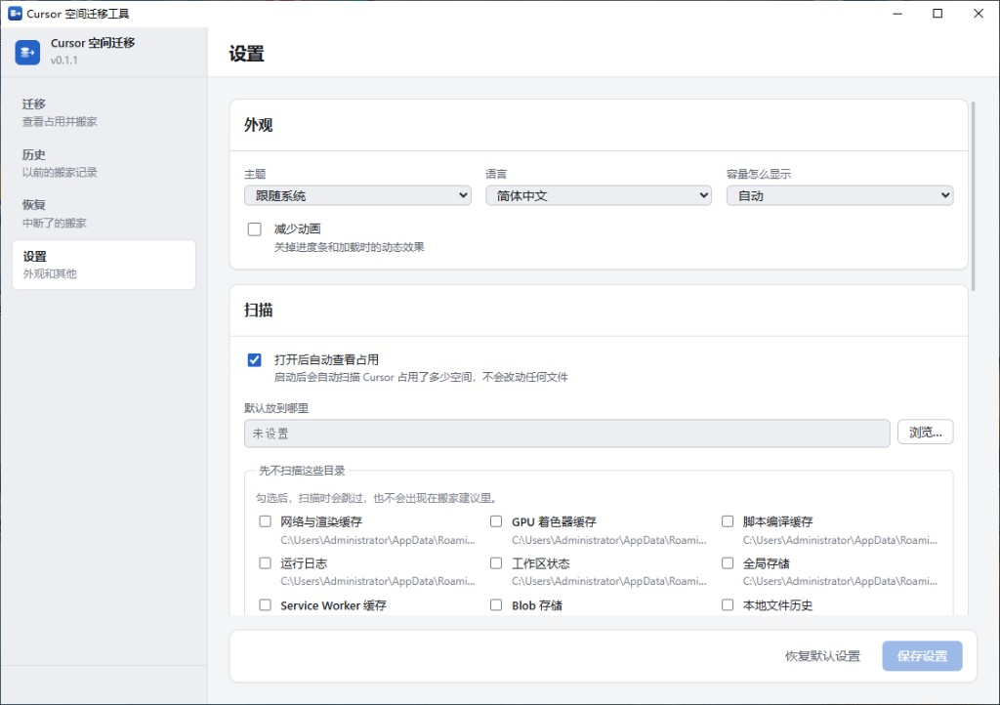

# Cursor Space Manager

[简体中文](README.md)

[](LICENSE)
[](https://github.com/JackXhl/cursor-space-manager/releases)

<p align="center">
  
</p>
<p align="center">
  
</p>

## Why it does not throw your data away

A tool that moves user data fails more expensively than it saves gigabytes.
The whole flow is built around one invariant: **a complete copy exists on disk
at every moment.**

- **It only starts after Cursor has fully quit**, including the tray. There is
  no force-kill button.
- **Copy, never move.** The source is left alone. `robocopy` is used without
  `/MOVE`, `/MIR`, or `/PURGE`.
- **Per-file SHA-256, then cut over.** Copied SQLite files also get a read-only
  `PRAGMA quick_check`. A failed check deletes the copy only.
- **Cutover is atomic:** same-volume rename to backup → create the link →
  probe. Any step failure rolls back.
- **Source backups stay by default.** The system disk is not smaller until you
  confirm Cursor still works and remove them.
- **Cleanup re-checks the link** and will not recursively delete through a
  junction.
- **Every action is journaled** (`INTENT` then `RESULT`). Recovery diagnoses; it
  does not guess when the disk is ambiguous.

The install directory itself is not moved. Relocating the app binary breaks
auto-update and uninstall metadata.

## Usage

1. Open the app. A read-only scan lists the install, each data folder’s size,
   and the disks they sit on.
2. On **Choose**, tick folders and pick a local, always-connected NTFS disk
   with headroom after the copy.
3. On **Confirm**, acknowledge each risk and fully quit Cursor.
4. After the move, start Cursor. If everything looks right, come back and
   remove backups. That is when the system disk actually frees space.

**Undo** is available: restore from the backup if it is still there, or copy
back from the target after verification if it is not.

## Recovery

Do **not** delete folders that look duplicated. During a move that is
deliberate; the copy you delete might be the only complete one.

The **Recover** page reconciles the journal with the disk. It only diagnoses.
If Cursor will not start because the original path is gone, a backup named
`*.csm-backup-<timestamp>` is next to it — rename it back (or use Recover).
To remove a junction later, use `rmdir` without `/s`.

Journal and settings live in `%APPDATA%\com.cursorspacemanager.app\`, not
inside any Cursor folder.

## Build from source

You need Node.js 20+, Rust stable, and on Windows the MSVC C++ build tools.

```bash
npm install
npm run tauri:dev     # development
npm run tauri:build   # installers
npm run typecheck
npm run test:rust
```

## Contributing

Issues and pull requests are welcome. Keep the diff focused, and put
user-visible copy in both `frontend/src/i18n/locales/zh-CN.ts` and `en.ts`.

Security reports: [SECURITY.md](SECURITY.md). Changelog: [CHANGELOG.md](CHANGELOG.md).

## Support

If this tool saved you some disk space, you can buy the maintainer a coffee.

<p align="center">
  
  &nbsp;
  
</p>

<p align="center"><sub>WeChat Pay (left) · Alipay (right)</sub></p>

## License

[MIT](LICENSE)
